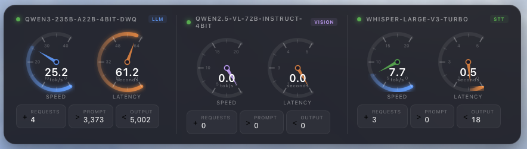
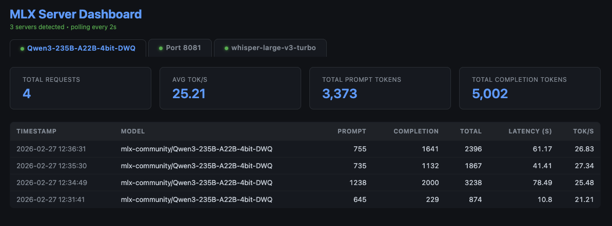

# MLX Cockpit

Live performance monitoring for [MLX](https://github.com/ml-explore/mlx) inference servers on Apple Silicon.



## What it does

MLX Cockpit gives you real-time visibility into your local LLM servers:

- **Desktop Widget** — Speedometer gauges showing tok/s, latency, and request stats for each model. Draggable, always-on-top, auto-refreshes every 3s.
- **Web Dashboard** — Tabbed view with live request table, summary cards, and per-model metrics. Polls every 2s.
- **Metrics API** — `/v1/metrics` JSON endpoint added to both mlx-lm and mlx-vlm servers. Build your own integrations.
- **Auto-Discovery** — Scans ports 8080–8090 automatically. No manual config needed.
- **Model Type Detection** — Identifies LLM, Vision, and STT models from process args and model names.

Supports **multiple models simultaneously** — text (mlx-lm), vision (mlx-vlm), and speech (whisper) side by side.

## Screenshots

| Desktop Widget | Web Dashboard |
|---|---|
|  |  |

## Requirements

- macOS on Apple Silicon (M1/M2/M3/M4)
- Python 3.10+
- [mlx-lm](https://github.com/ml-explore/mlx-examples/tree/main/llms/mlx_lm) — for text model server
- [mlx-vlm](https://github.com/Blaizzy/mlx-vlm) — for vision model server (optional)
- [Übersicht](https://tracesof.net/uebersicht/) — for the desktop widget (optional)

## Quick Start

```bash
# Clone the repo
git clone https://github.com/<your-username>/mlx-cockpit.git
cd mlx-cockpit

# Run the installer (patches servers + installs widget)
./scripts/install.sh

# Start your servers (any port from 8080-8090)
python -m mlx_lm.server --model mlx-community/Qwen3-235B-A22B-4bit-DWQ --port 8080
python -m mlx_vlm.server --port 8081

# Open the dashboard
open http://localhost:8080/dashboard
```

## What the installer does

1. **Patches mlx_lm** — Adds `/v1/metrics` and `/dashboard` endpoints to `mlx_lm/server.py`
2. **Patches mlx_vlm** — Adds `/v1/metrics` endpoint and CORS support to `mlx_vlm/server.py`
3. **Installs scan script** — Copies `mlx-scan.sh` to `~/.mlx-cockpit/`
4. **Installs widget** — Copies the Übersicht widget with the correct scan script path

Backups (`.bak`) are created before patching. See `server-patches/` for the exact code that gets inserted.

## Manual Installation

### 1. Metrics Endpoints (required)

```bash
# Patch mlx-lm
python3 scripts/patch_mlx_lm.py

# Patch mlx-vlm (optional)
python3 scripts/patch_mlx_vlm.py
```

### 2. Desktop Widget (optional)

Copy the widget file to Übersicht:

```bash
cp widget/mlx-cockpit.widget.jsx ~/Library/Application\ Support/Übersicht/widgets/
```

Install Übersicht if you don't have it:

```bash
brew install --cask ubersicht
```

## Configuration

### Ports

The widget and dashboard auto-discover MLX servers on **ports 8080–8090**. Start your servers on any port in that range — no configuration needed.

### Model Type Detection

Servers are automatically classified:
- **LLM** — Default for `mlx_lm` processes
- **Vision** — `mlx_vlm` processes, or model names containing `VL`/`vision`
- **STT** — Model names containing `whisper`/`stt`/`speech`

### Themes

Click the widget to open the dashboard. Themes are stored in `localStorage` under `mlx-cockpit-theme`. Available: default, cyberpunk, matrix, ocean, sunset.

### Refresh Rate

Default: 3 seconds. Change `refreshFrequency` in the widget file (value in milliseconds).

## Uninstall

```bash
./scripts/uninstall.sh
```

This restores the original (unpatched) server files from `.bak` backups, removes the scan script from `~/.mlx-cockpit/`, and removes the Übersicht widget.

## Metrics API

Both servers expose `/v1/metrics` returning:

```json
{
  "requests": [
    {
      "timestamp": "2025-01-15 14:30:22",
      "model": "mlx-community/Qwen3-235B-A22B-4bit-DWQ",
      "prompt_tokens": 735,
      "completion_tokens": 1896,
      "total_tokens": 2631,
      "latency": 72.28,
      "tokens_per_sec": 26.23
    }
  ],
  "summary": {
    "total_requests": 42,
    "avg_tokens_per_sec": 24.5,
    "total_prompt_tokens": 15000,
    "total_completion_tokens": 50000
  }
}
```

## Project Structure

```
mlx-cockpit/
  widget/                    # Übersicht desktop widget
    mlx-cockpit.widget.jsx
    mlx-scan.sh              # Server discovery script (scans ports 8080-8090)
  dashboard/                 # Standalone dashboard HTML
    index.html
  server-patches/            # Reference: metrics code inserted by patch scripts
    mlx_lm_metrics.py
    mlx_vlm_metrics.py
  scripts/                   # Install, patch & utility scripts
    install.sh
    uninstall.sh
    patch_mlx_lm.py
    patch_mlx_vlm.py
  assets/                    # Screenshots & media
  README.md
  LICENSE
```

## Roadmap

- [ ] Upstream PR to mlx-lm for built-in `/v1/metrics`
- [ ] Upstream PR to mlx-vlm for built-in `/v1/metrics`
- [ ] Native macOS menubar app (SwiftUI) — no Übersicht dependency
- [ ] WidgetKit integration for macOS desktop widgets
- [ ] Homebrew formula: `brew install mlx-cockpit`
- [ ] GPU temperature & memory usage overlay
- [ ] Historical charts (tok/s over time)
- [ ] Multi-machine support (monitor remote servers)

## Contributing

Contributions welcome! Open an issue or PR.

## License

MIT
